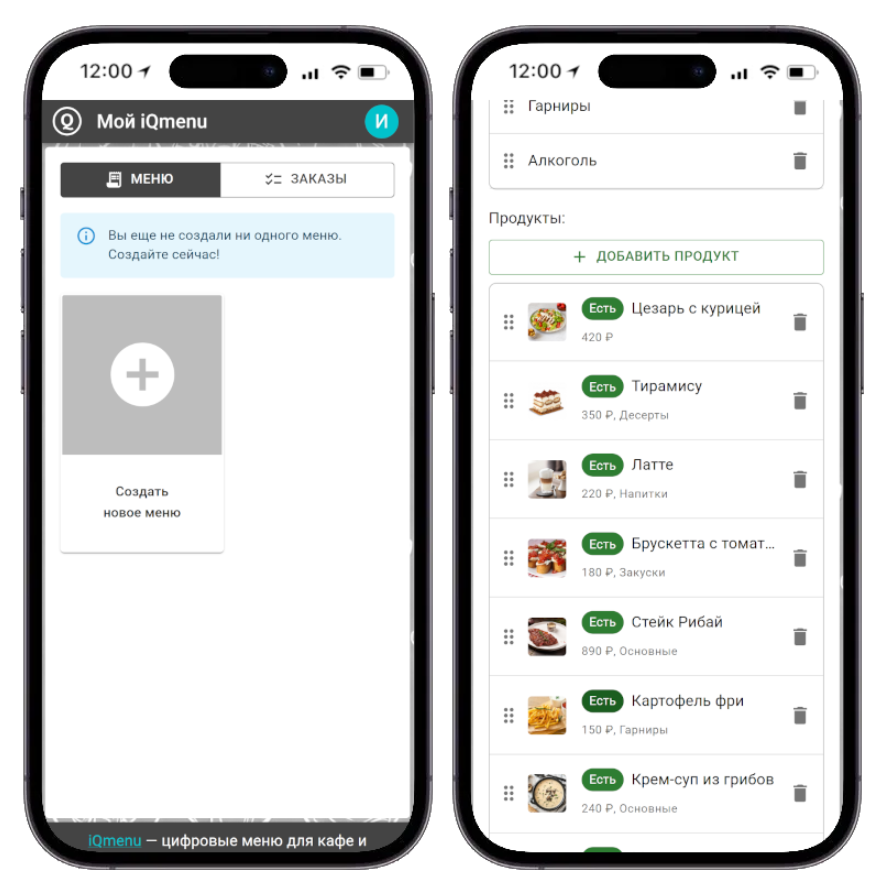
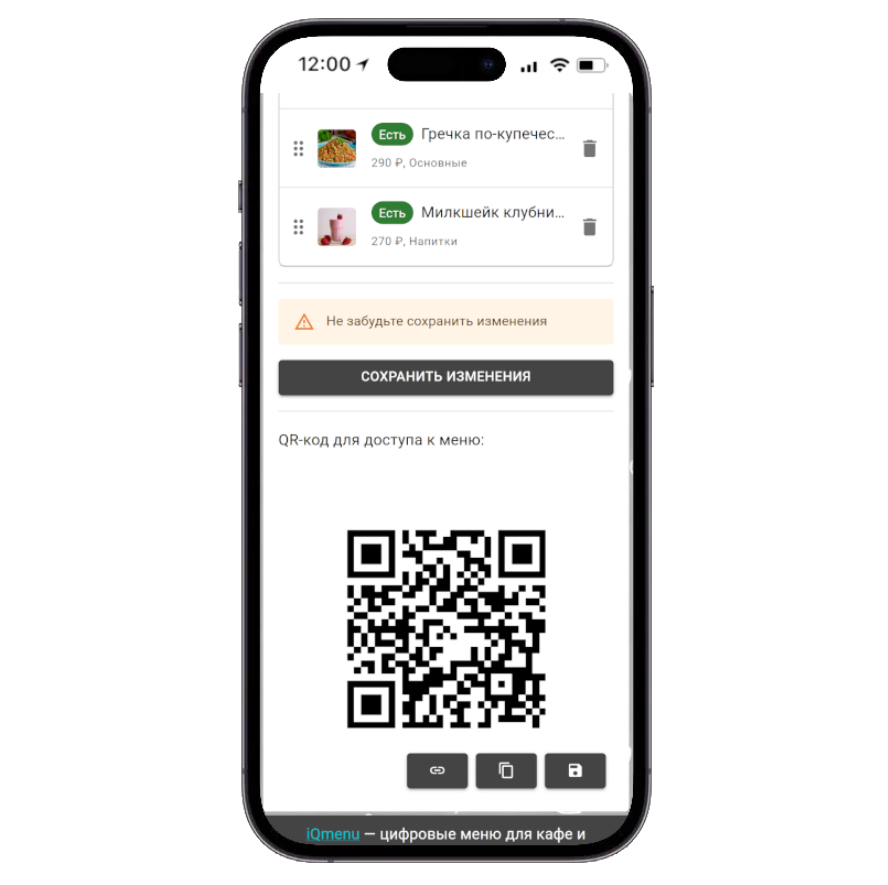
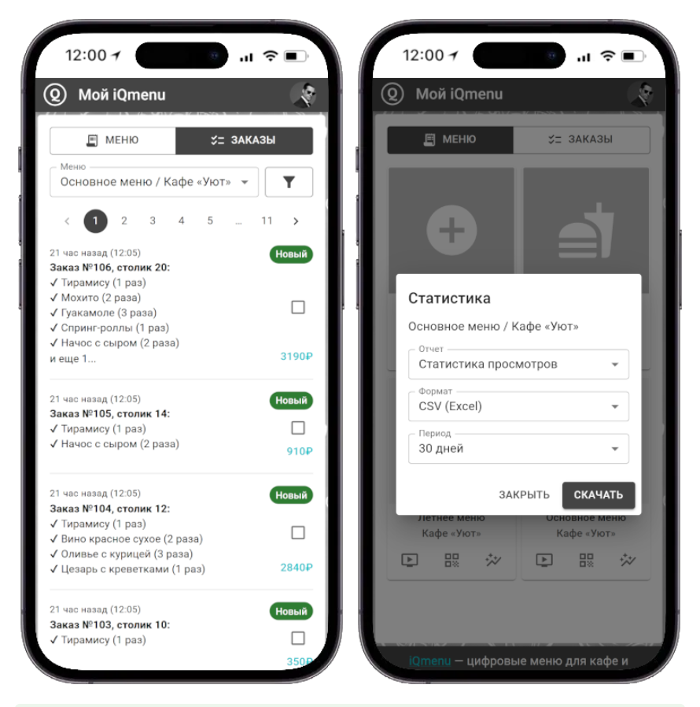

# iQmenu

Сервис по созданию электронных QR-код меню для кафе и ресторанов.

<div align=center>
  
</div>

## Подробности

Наш сервис позволяет создавать гибкие электронные меню, доступные для просмотра по QR-коду. Сервис позволяет гостям заведений оформлять заказы по меню, а администраторам обрабатывать заказы и отслеживать статистику заказов и просмотров. Сервис рассчитан на владельцев и админисраторов кафе, ресторанов, столовых и других заведений общественного питания.

## Как создать меню?

**Шаг 1.** Войдите или зарегистрируйтесь в приложении
**Шаг 2.** Создайте новое меню и заполните его продуктами



**Шаг 3.** Получите QR-код и разместите его в заведении



**Шаг 4.** Отслеживайте заказы и скачивайте статистику ваших меню



## Страницы интерфейса

[pages.md](/docs/pages.md)

## Эндпоинты API

[endpoints.md](/docs/endpoints.md)

## Стек технологий

**MERN:** MongoDB + Express JS + React JS (+ Material UI) + Node JS.

- **MongoDB** - база данных.
- **Express JS** - Rest API.
- **React JS (+ Material UI)** - веб-интерфейс на основе библиотеке компонентов Material UI.
- **Node JS** - сервер.

## Технические особенности

iQmenu - это веб-приложение. Интерфейс адаптирован для ПК, планшетов и смартфонов.

## Запуск проекта

**Полный запуск проекта**

>[!WARNING]
> ВЫПОЛНИТЕ ИНСТРУКЦИИ ВНУТРИ ФАЙЛА run.bat ПЕРЕД ЕГО ЗАПУСКОМ

Запуск:

```cmd
run.bat
```

Для полного запуска проекта для тестирования нужно использовать скрипт run.bat в папке проекта.
Подробнее о его использовании смотри в файле run.bat.

**Запуска посева**

Посев это скрипт для очищения БД. Удаляет все данные из БД и добавляет заранее подготовленные для тестирования данные. Какие это конкретно данные можно посмотреть в файле `/api/scripts/seed.js`. Там же можно найти номера телефонов и пароли для авторизации.

Запуск:

```cmd
cd api
npm run seed
```